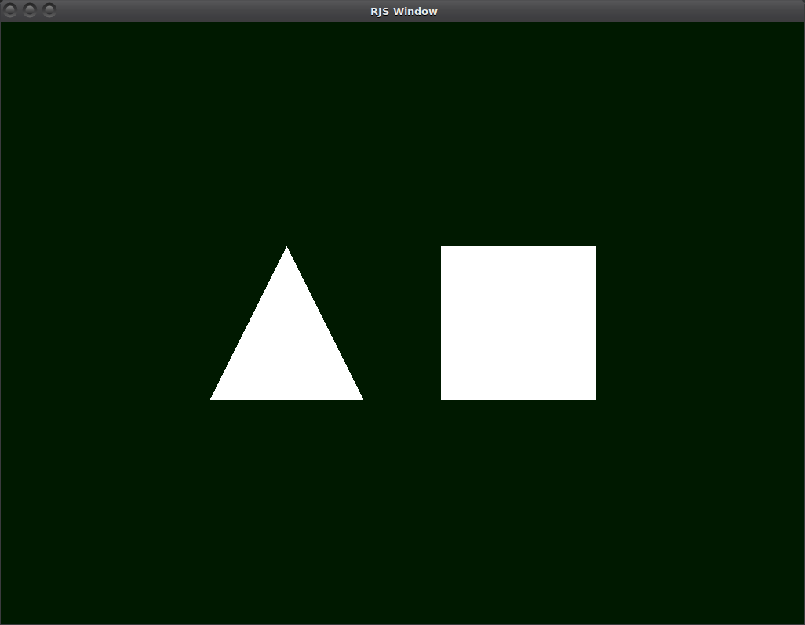

# rjs
Native Javascript environment using Rust and Mozilla's SpiderMonkey JS engine.

## Why?
This project would like to be:
- A way to use Javascript to make Android games, using a thin WebGL/GLES binding.
- Javascript compatible with Node.js.
- An easy to use binding for Rust projects to embed a Javascript engine.
- A superhero.

This is going to take a lot of work, and there are things for everyone to do, so 
peek into the Issues and look for a "help wanted" issue to get started!

## Why not?
- Why not use straight Rust?  
  Javascript with hot module reloading has a faster edit-compile-run cycle.
  
- Why not V8?  
  It's time for SpiderMonkey to find more uses outside of Firefox.
  
## Build
- Ensure you are using rust nightly:  https://doc.rust-lang.org/1.13.0/book/nightly-rust.html
- If you attempt cargo build and receive:  error[E0412]: cannot find type `NonNull` in module `ptr` then you are
  not using nightly.
- confirm with rustc --version
- On debian rust nightly installs to /usr/local/bin/rustc & the standard rustup installs to ~/.cargo/bin/rustc
- git clone --recursive https://github.com/rjs-team/rjs.git
- cd rjs
- cargo build
- Test with:
    - ./target/debug/rjs ./examples/webgl/webgl.js
    - If all went well you should see:
    

